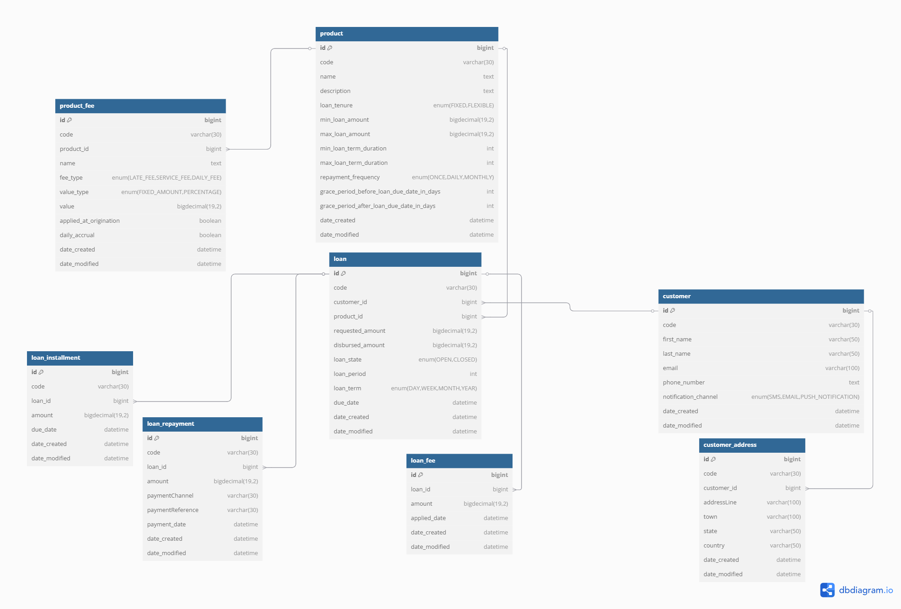
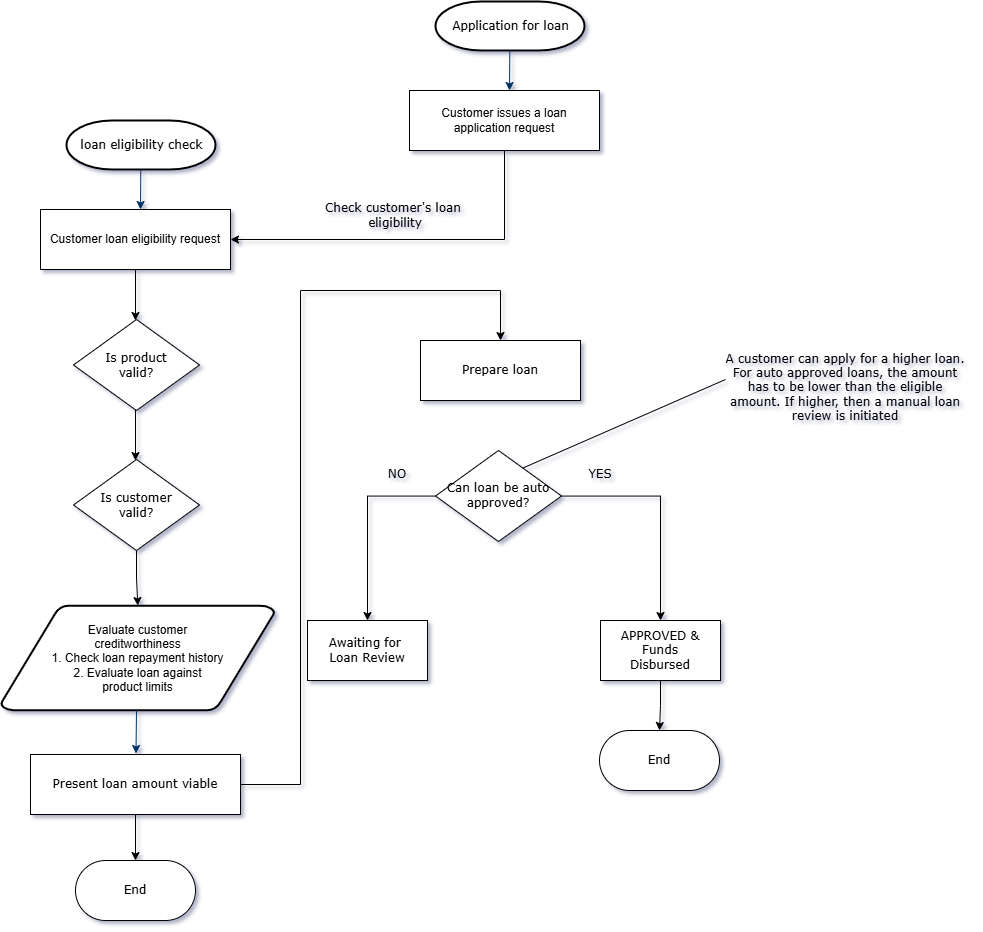
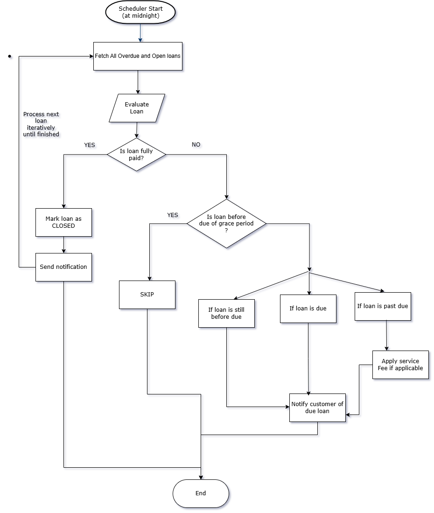

# Money Lending Application

## Description

This is a simple money lending application that allows users to borrow money and repay it back.

The Application comes with a couple of features:

1. Ability to create loan products. A loan product provides a template for define the rules that apply when a user
   borrows money. The rules include the interest rate, the minimum and maximum amount that can be borrowed,
   the duration of the loan and the repayment frequency.
   Currently, there are 2 loan tenure types:
    - Flexible
    - Fixed
2. Ability to create/enrol a loan borrowing customer.
3. Ability to assess the eligibility of a customer to borrow a loan. The eligibility is based on the rules
   defined in the loan product. The eligibility feature allows the user to know if they can borrow a loan and how much
4. Ability to apply for a loan.

The application also comes with other features:

1. A scheduler that runs every day at 6am to calculate the interest on the loans that are due for repayment.
2. Dynamic notification template setup. These templates define the type of message a customer will receive based on the
   status of a customer's loan.
3. Dummy support for different notification channels.

## Technical Details

### Overview of the schema

The schema of the application is shown below:

### Flow

#### Loan Product Creation

1. A customer can check for their loan eligibility. The eligibility is based on the customer's creditworthiness as well
   as
   rules defined in the loan product.
2. A customer can apply for a loan. The loan verification flow is based on the customer's eligibility and product rules.
   There are two immediate outcomes from the loan application flow:
    - The loan is auto approved based on the customer eligibility.
    - The loan is pending review if the customer requests for a higher amount.
      

#### Scheduler
1. The scheduler runs daily, and evaluates the loans that are due for repayment.

See scheduler flow below

### Technologies Used
1. Java 21
2. Spring boot 3.4.3
3. MySQL
4. Liquibase

